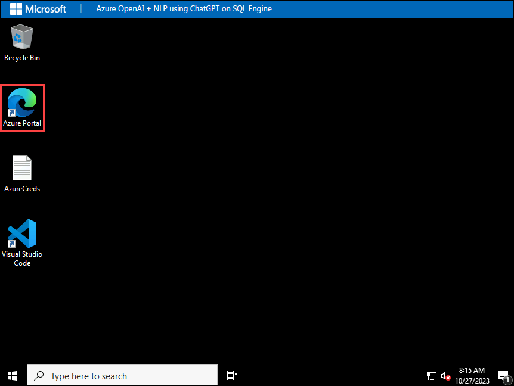
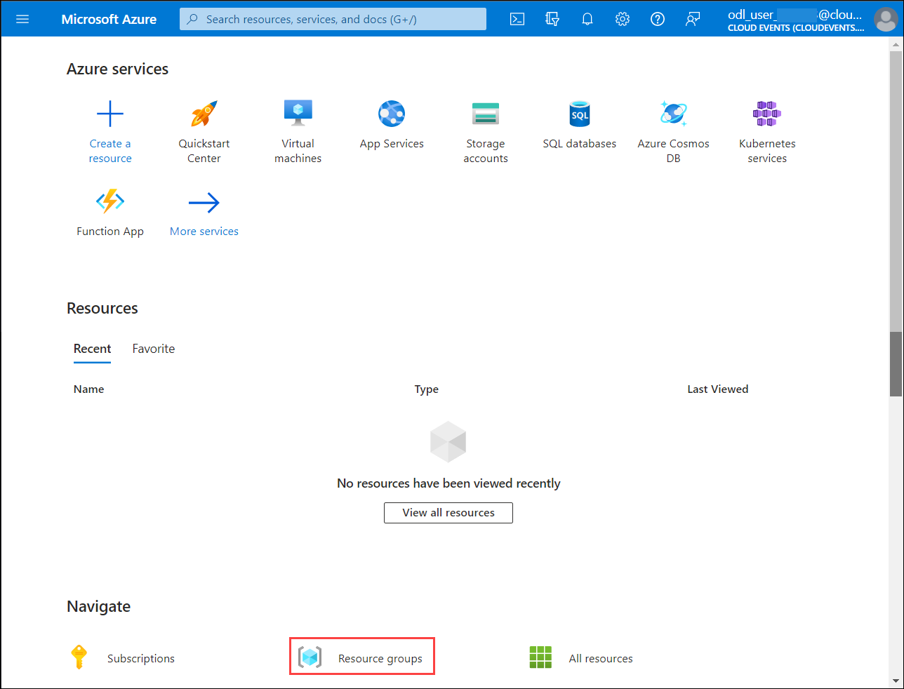
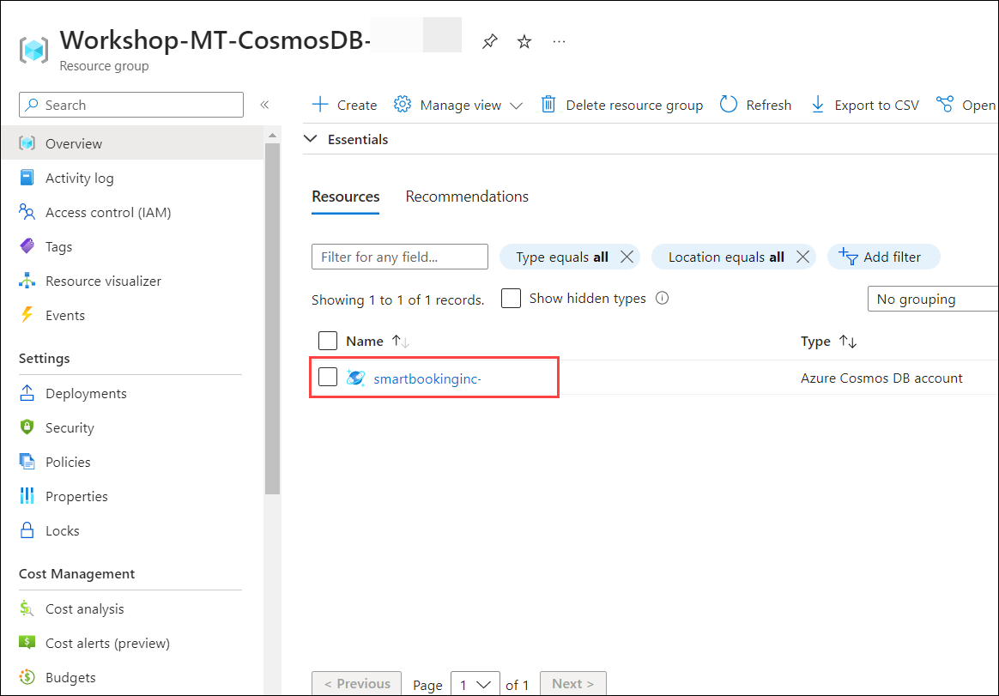
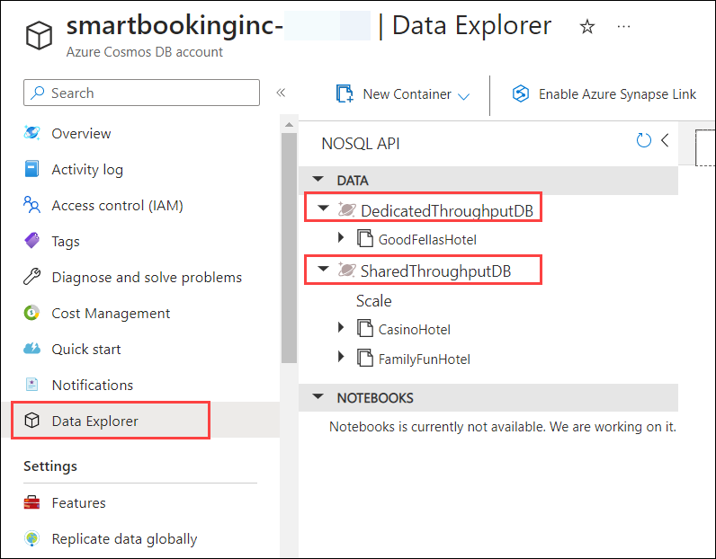

# **Getting Started with Your CosmosDB_Multi-Tenant Workshop**
 
Welcome to your CosmosDB_Multi-Tenant workshop! We've prepared a seamless environment for you to explore and learn about Azure services. Let's begin by making the most of this experience:
 
## **Accessing Your Lab Environment**
 
Once you're ready to dive in, your virtual machine and lab guide will be right at your fingertips within your web browser.
 
  .png)

### **Virtual Machine & Lab Guide**
 
Your virtual machine is your workhorse throughout the workshop. The lab guide is your roadmap to success.
 
## **Exploring Your Lab Resources**
 
To get a better understanding of your lab resources and credentials, navigate to the **Environment Details** tab.
 
   .png)
 
## **Utilizing the Split Window Feature**
 
For convenience, you can open the lab guide in a separate window by selecting the **Split Window** button from the Top right corner.
 
  .png)
 
## **Managing Your Virtual Machine**
 
Feel free to start, stop, or restart your virtual machine as needed from the **Resources** tab. Your experience is in your hands!
 
    
 
## **Let's Get Started with Azure Portal**
 
1. On your virtual machine, click on the **Azure Portal** icon as shown below:
 
     

1. On **Sign in to Microsoft Azure** tab you will see the login screen, enter the following email/username and then click on **Next**. 
   * Email/Username: <inject key="AzureAdUserEmail"></inject>
   
     
     
1. Now enter the following password and click on **Sign in**.
   * Password: <inject key="AzureAdUserPassword"></inject>
   
     

1. If you see the pop-up **Stay Signed in?**, click No

1. If you see the pop-up **You have free Azure Advisor recommendations!**, close the window to continue the lab.

1. If a **Welcome to Microsoft Azure** popup window appears, click **Maybe Later** to skip the tour.
   
1. Now you will see the Azure Portal Dashboard, click on **Resource groups** from the Navigate panel to see the resource groups.

    
 
    > **Hint**: To view **Resource groups**, you may need to scroll down. 
   
1. In Resource groups page, click on **Workshop-MT-CosmosDB--<inject key="DeploymentID" enableCopy="false" />**.

    

1. Then select your Azure Cosmos DB account **smartbookinginc-<inject key="DeploymentID" enableCopy="false" />** from the Workshop-MT-CosmosDB-<inject key="DeploymentID" enableCopy="false" /> resource group.

    

1. Once you are inside Azure Cosmos DB account from the left side menu click on **Data Explorer**, and verify the **DedicatedThroughputDB** and **SharedThroughputDB** databases.

    

1. Navigate to **Azure Cosmos DB for Multitenant Applications Workshop** GitHub repository to start with the challenges in this workshop.

   ```
   https://github.com/microsoft/CosmosDB_Multi-Tenant
   ```
 
Now you're all set to explore the powerful world of technology. Feel free to reach out if you have any questions along the way. Enjoy your workshop!
