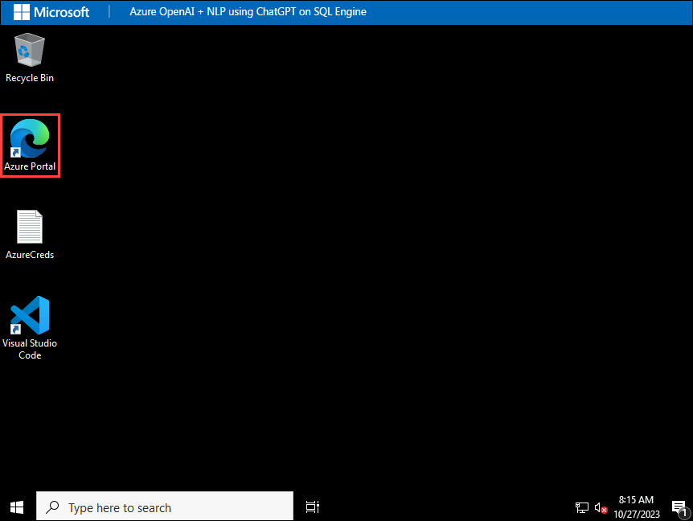
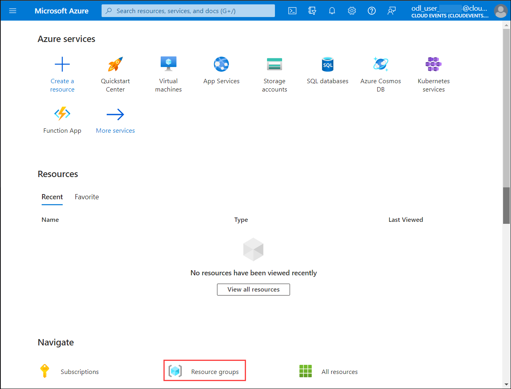
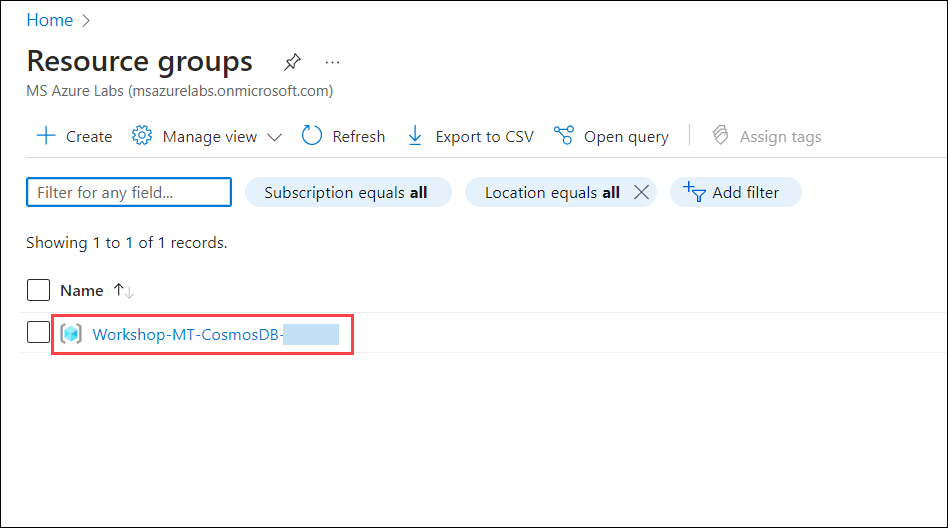
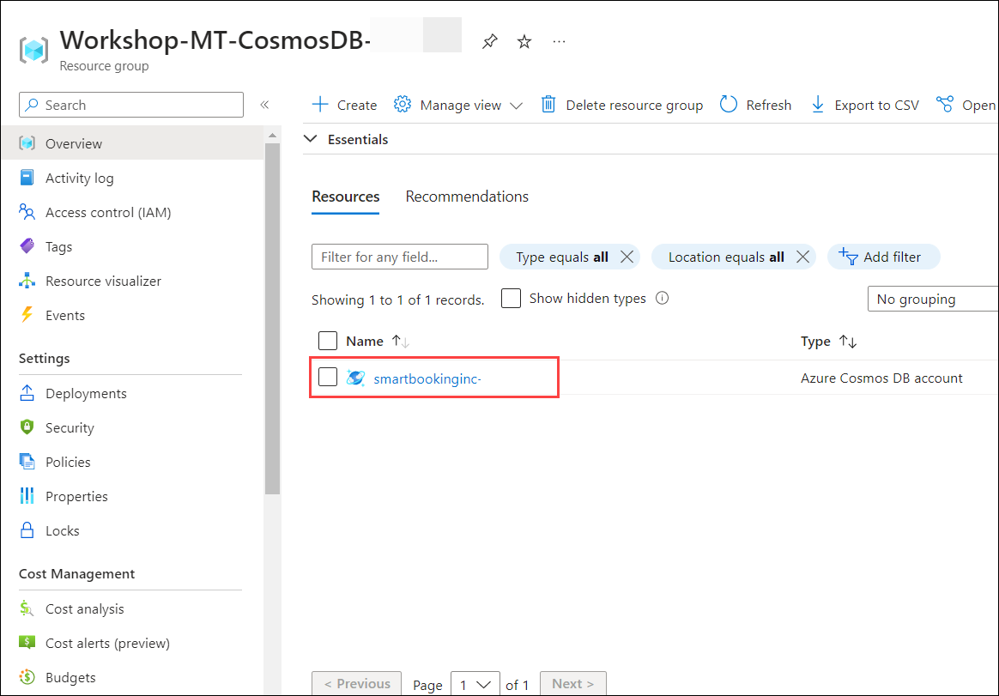
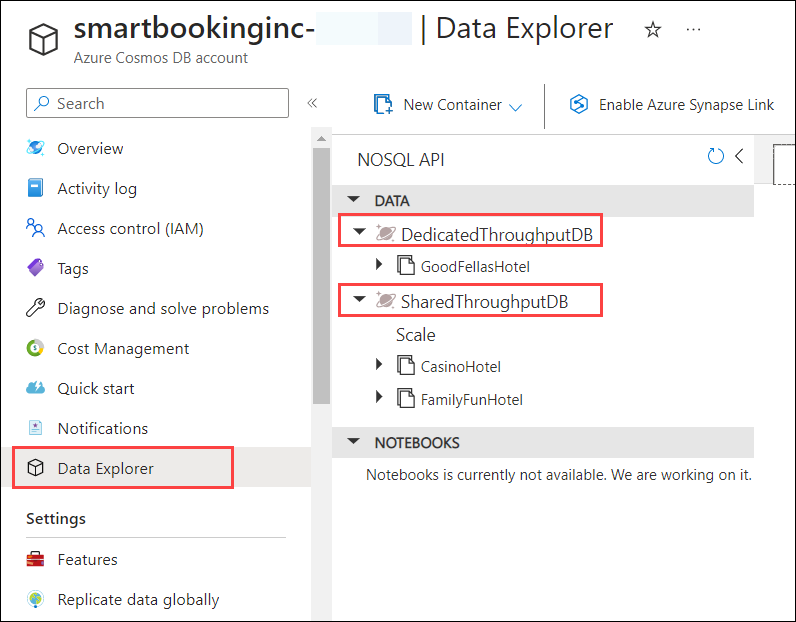

## Getting Started with Lab

1. Once the environment is provisioned, a virtual machine (JumpVM) and lab guide will get loaded in your browser. Use this virtual machine throughout the workshop to perform the lab. You can see the number on the bottom of the lab guide to switch to different exercises of the lab guide.

   .png)
 
1. To get the lab environment details, you can select the **Environment Details** tab. Additionally, the credentials will also be emailed to your registered email address. You can also open the Lab Guide in a separate and full window by selecting the **Split Window** from the lower right corner. Also, you can start, stop and restart virtual machines from the **Resources** tab.

   .png "Enter Email")
 
   > You will see the SUFFIX value on the **Environment Details** tab, use it wherever you see SUFFIX or DeploymentID in lab steps.

1. You can also open the Lab Guide in a separate and full window by selecting the **Split Window** from the top right corner.

    .png)

## Login to Azure Portal

1. In the JumpVM, click on the Azure portal shortcut of the Microsoft Edge browser which is created on the desktop.

   

1. On **Sign in to Microsoft Azure** tab you will see the login screen, enter the following email/username and then click on **Next**. 
   * Email/Username: <inject key="AzureAdUserEmail"></inject>
   
     
     
1. Now enter the following password and click on **Sign in**.
   * Password: <inject key="AzureAdUserPassword"></inject>
   
     

1. If you see the pop-up **Stay Signed in?**, click No

1. If you see the pop-up **You have free Azure Advisor recommendations!**, close the window to continue the lab.

1. If a **Welcome to Microsoft Azure** popup window appears, click **Maybe Later** to skip the tour.
   
1. Now you will see the Azure Portal Dashboard, click on **Resource groups** from the Navigate panel to see the resource groups.

    
 
    > **Hint**: To view **Resource groups**, you may need to scroll down. 
   
1. In Resource groups page, click on **Workshop-MT-CosmosDB--<inject key="DeploymentID" enableCopy="false" />**.

    

1. Then select your Azure Cosmos DB account **smartbookinginc-<inject key="DeploymentID" enableCopy="false" />** from the Workshop-MT-CosmosDB-<inject key="DeploymentID" enableCopy="false" /> resource group.

    

1. Once you are inside Azure Cosmos DB account from the left side menu click on **Data Explorer**, and verify the **DedicatedThroughputDB** and **SharedThroughputDB** databases.

    

1. Navigate to **Azure Cosmos DB for Multitenant Applications Workshop** GitHub repository to start with the challenges in this workshop.

   ```
   https://github.com/microsoft/CosmosDB_Multi-Tenant
   ```
